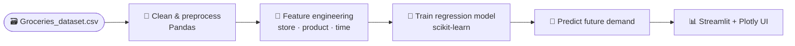

<div align="center">


# 🛒 Grocery Sales Predictor

### A **seasonal demand-forecasting** app that predicts grocery sales from store, product &amp; temporal signals — served through an interactive Streamlit dashboard.

<p>
  
  
  
  
  
  
</p>

<p>
  <a href="#-overview"><b>Overview</b></a> ·
  <a href="#-how-it-works"><b>How it works</b></a> ·
  <a href="#-quick-start"><b>Quick Start</b></a> ·
  <a href="#-project-structure"><b>Structure</b></a>
</p>

</div>

---

> Give it a store, a product and a time window — it forecasts expected demand. The model learns seasonal and temporal patterns from historical transactions, and the **Streamlit** app turns those predictions into interactive Plotly charts so you can plan stock before the season hits.

---

## 📑 Table of Contents

- [✨ Features](#-features)
- [🧠 How It Works](#-how-it-works)
- [⚡ Quick Start](#-quick-start)
- [🚀 Running It](#-running-it)
- [🗂 Project Structure](#-project-structure)
- [📸 Screenshots](#-screenshots)
- [🧰 Tech Stack](#-tech-stack)
- [🗺 Roadmap](#-roadmap)
- [📄 License](#-license)

---

## ✨ Features

- 📈 **Seasonal demand forecasting** trained on real grocery transaction data (`Groceries_dataset.csv`).
- 🧪 **Feature engineering** across store, product and temporal attributes (seasonality, recency, calendar).
- 🤖 **Gradient-boosted regression (scikit-learn)** for the prediction model.
- 🖥️ **Interactive multi-page Streamlit app** with Plotly visualizations and Lottie animations.
- 🔮 **Future-demand projection** scripts for batch / programmatic predictions.
- 📄 Includes a full **IEEE-format project report** documenting the methodology.

---

## 🧠 How It Works



---

## ⚡ Quick Start

```bash
git clone https://github.com/AyushDas4890/Grocery-sales-predictor.git
cd Grocery-sales-predictor

python -m venv venv
source venv/bin/activate          # Windows: venv\Scripts\activate

pip install -r requirements.txt
```

---

## 🚀 Running It

<details open>
<summary><b>🌐 Streamlit app (recommended)</b></summary>

```bash
streamlit run streamlit_app.py    # opens http://localhost:8501
```
Pick a store/product and explore forecasted demand with interactive charts.
</details>

<details>
<summary><b>🔮 Batch prediction</b></summary>

```bash
python run_full_prediction.py     # end-to-end prediction run
python predict_future_demand.py   # project future demand
```
</details>

<details>
<summary><b>📓 Training notebook</b></summary>

Open `Seasonal_Demand_Prediction_Final_Workflow.ipynb` to see the full data-to-model workflow.
</details>

---

## 🗂 Project Structure

```
Grocery-sales-predictor/
├── streamlit_app.py                              # ⭐ interactive app
├── Seasonal_Demand_Prediction_Final_Workflow.ipynb   # full training workflow
├── run_full_prediction.py                        # end-to-end prediction
├── predict_future_demand.py                      # future-demand projection
├── notebook_prediction_code.py                   # extracted prediction code
├── Groceries_dataset.csv                         # source data
├── IEEE Project Report.pdf                        # methodology write-up
└── requirements.txt
```

---

## 📸 Screenshots

> _Drop a screenshot/GIF of the app here once it's running._
> ```markdown
> 
> 
> ```

---

## 🧰 Tech Stack

`Python` · `scikit-learn` · `Pandas` · `NumPy` · `Streamlit` · `streamlit-lottie` · `Plotly`

---

## 🗺 Roadmap

- [ ] Add evaluation metrics (MAE / RMSE) to the UI
- [ ] Compare multiple models side by side
- [ ] Upload-your-own-CSV mode
- [ ] Deploy to Streamlit Community Cloud

---

## 📄 License

Released under the **MIT License** © 2026 Ayush Das. _(Add a `LICENSE` file if not present.)_

<div align="center"><sub>Forecasting demand before the season hits.</sub></div>
